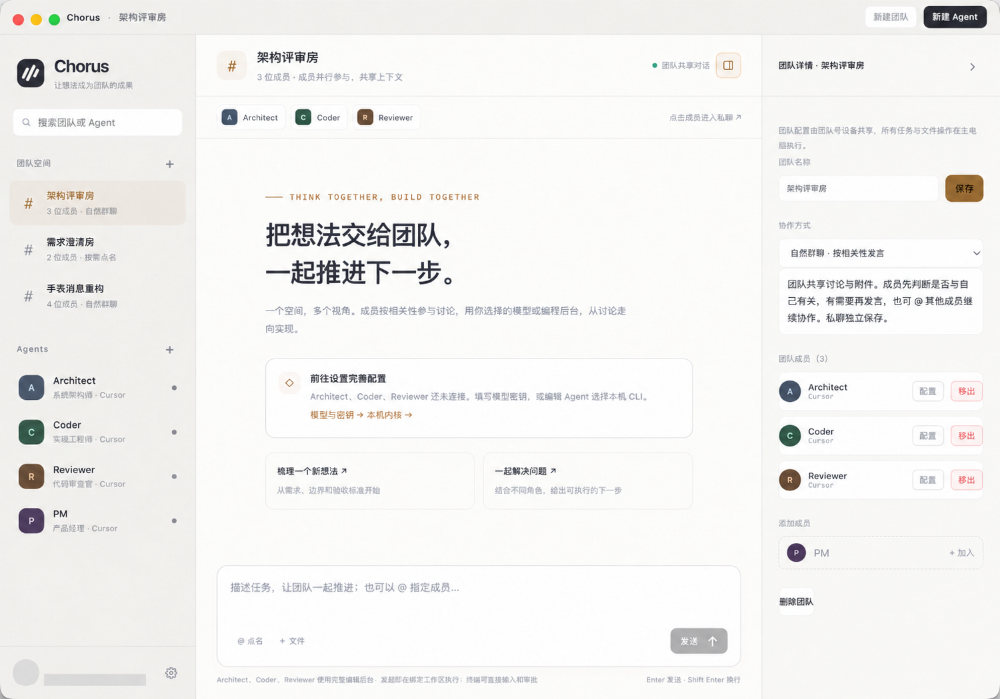

<p align="right"><a href="./README_EN.md">English</a></p>

# Chorus

> 把 Codex、Claude Code、Cursor 和不同职责的 AI Agent 放进同一个项目群：共享上下文、按需接力，并在 Mac 的真实工作区里继续执行。

Chorus 是一个运行在 macOS 上的多 Agent 协作工作台。你可以给 Agent 分配产品、架构、实现、审查等职责，让它们在同一场对话里讨论，也可以用 `@成员名` 明确指定下一位接手。

> **当前状态：早期源码体验版。** 目前面向 macOS 13+ 的 Apple Silicon Mac，需要 Node.js 22.12+。仓库暂未提供可直接下载的 Release；本地构建的 DMG 使用 ad-hoc 签名，未做 Apple 公证。



## 为什么做 Chorus

我经常遇到一种情况：产品思路在一个对话里，代码写在另一个工具里，审查时又要重新解释一遍背景。工具不少，上下文却一直在手工搬运。

Chorus 想解决的是这件小事：

- **把不同职责放进同一个房间**：已经完成的回复会成为后续成员的共享上下文。
- **让 Agent 知道什么时候该说话**：成员可以按相关性参与，也可以设置为仅响应 `@` 点名。
- **把讨论交给真实工具继续做**：Agent 可以调用 Mac 上已有的 Codex、Claude Code 或 Cursor CLI，直接进入项目工作区。
- **模型和工具自己选**：支持 OpenAI、Anthropic、Ollama、自定义 OpenAI 兼容接口，以及已经登录的编程 CLI。
- **人不在电脑前也能跟进**：可选自建中转站，让 Android 发送任务和查看回复；实际执行仍发生在 Mac。

它不是把几段独立回复并排展示，而是让讨论、交接和执行留在同一条任务线上。

## 三步开始

### 1. 跑起桌面端

```bash
git clone https://github.com/aijianiula0601/agents-team.git
cd agents-team/mac-app
npm ci
npm run dev
```

### 2. 接入一个可用后台

打开「设置 → 模型与密钥」，任选一种方式：

- 配置 OpenAI、Anthropic、Ollama 或 OpenAI 兼容接口；
- 或安装并登录 Codex、Claude Code、Cursor CLI。

如果希望 Agent 直接读取和修改项目，请选择编程 CLI 后台，并绑定对应工作区。

### 3. 建一个团队，发出第一条任务

新建「架构师」「实现工程师」「代码审查员」三个 Agent，把它们加入同一个团队，然后试试：

```text
@架构师 请先阅读现有项目，给出最小改动方案、风险和验收点。
方案确认后，请点名实现工程师接手；实现完成后，再交给代码审查员检查回归风险。
```

只在 Mac 上使用时，不需要部署中转站，也不需要注册中转站账号。

## 一次接力会怎样进行

| Agent | 职责 | 后台 | 工作区 |
|---|---|---|---|
| 架构师 | 梳理结构与改动边界 | 模型或编程 CLI | 项目目录 |
| 实现工程师 | 修改代码、补充测试 | Codex / Claude Code / Cursor | 项目目录 |
| 代码审查员 | 检查兼容性与回归风险 | 编程 CLI | 同一项目目录 |

将团队设为「仅点名」后：

1. 架构师先读取任务和已有上下文，给出方案；
2. 回复中的准确 `@实现工程师` 会触发下一位成员接手；
3. 实现工程师通过绑定的 CLI 在项目目录中修改文件并运行测试；
4. 完成后再 `@代码审查员`，审查员结合前面的讨论和当前代码检查结果；
5. 同一工作区的执行任务会排队，减少多个 Agent 同时写文件造成的冲突。

Agent 能否给出正确结果，仍取决于所选模型、CLI、提示词和项目本身。Chorus 负责组织上下文与执行流程，不替代代码审查和最终确认。

## 目前能做什么

- 创建不同人设、职责和后台的 Agent；
- 建立团队房间，保留团队共享上下文；
- 在「自然群聊」和「仅 `@` 回应」之间切换；
- 通过 `@成员名` 进行成员间交接；
- 调用 Codex、Claude Code、Cursor CLI 处理真实工作区；
- 使用 OpenAI、Anthropic、Ollama 和自定义 OpenAI 兼容接口；
- 查看流式回复和执行进度，并通过内置终端处理交互与停止；
- 可选连接自建中转站，在 Android 上发送任务、查看回复和管理团队。

## 适合与不适合

Chorus 可能适合你，如果你已经在混用多个模型或编程 Agent，希望把需求、实现和审查放在同一条任务线上，并愿意自己配置 API、CLI 和工作区。

当前可能不适合以下场景：

- 需要下载后直接安装、无需开发环境的正式发行版；
- 需要 Windows 或 Linux 桌面客户端；
- 需要完全离线且所有内容都不经过外部服务；
- 需要无人值守、无需人工复核的生产自动化；
- 希望不自建服务就直接使用手机同步。

工作区和编程 CLI 在 Mac 上执行，但这不等于所有数据都只在本机：使用云模型时，请求会发送给对应模型服务；启用跨设备同步后，聊天和任务会经过你自建的中转站。

## 可选：从 Android 连接 Mac

Android 端不在手机上运行 Codex、Claude Code 或 Cursor。它负责发送任务、查看进度和管理团队，实际执行仍发生在保持在线的主电脑上。

跨设备功能需要自行部署 Go 中转站，并准备 MySQL、Redis 和 HTTPS 入口：

```text
Android ⇄ 自建中转站（Go · MySQL · Redis）⇄ Mac（模型 · CLI · 本机工作区）
```

- [macOS 客户端说明](mac-app/README.md)
- [Android 客户端说明](android-app/README.md)
- [中转服务说明](relay-service/README.md)
- [界面与使用说明](docs/README.md)

## 仓库结构

| 目录 | 内容 |
|---|---|
| [mac-app](mac-app/README.md) | Electron 桌面端、模型与 CLI 执行 |
| [android-app](android-app/README.md) | Capacitor 移动端 |
| [shared/web](shared/web/README.md) | 两端共用的界面与协作逻辑 |
| [relay-service](relay-service/README.md) | 账号、任务队列与实时同步 |
| [docs](docs/README.md) | 截图和使用说明 |

界面以 `shared/web/` 为唯一源，修改后运行 `node scripts/sync-ui.js` 同步到两端。

## 验证

```bash
cd mac-app && npm test
cd ../relay-service && go test ./... && go vet ./...
```

当前仓库验证结果：客户端 392 项测试通过，Go 全量测试和 `go vet` 通过。

## 反馈

这个项目现在最需要的不是一句“看起来不错”，而是真实任务跑下来后的反馈。

如果你愿意，可以拿自己的项目试一轮，然后告诉我：

1. 你让几个 Agent 做了什么；
2. 哪一步确实省了时间；
3. 哪一步让你卡住或觉得多余。

遇到问题或有想法，欢迎[提交 Issue](https://github.com/aijianiula0601/agents-team/issues/new)。请尽量带上 macOS 版本、Node.js 版本、使用的模型或 CLI，以及可复现步骤。

如果这个方向正好是你想找的，也欢迎点个 Star，让我知道它值得继续往下做。
